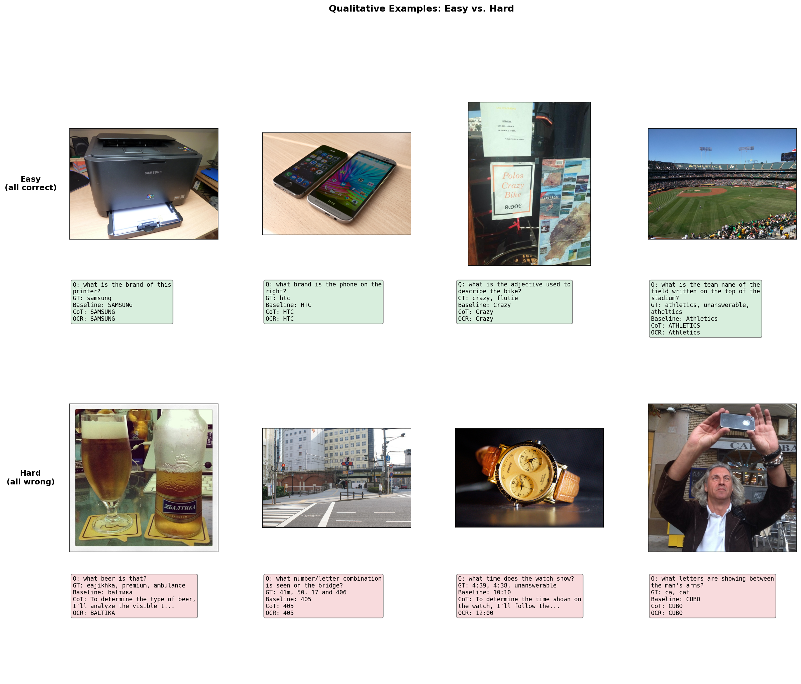

# Visual Understanding with TextVQA: Prompt Engineering with Qwen2.5-VL-3B

**SHBT 261 Final Project**

May 7, 2026

---

## Abstract

We evaluate the Qwen2.5-VL-3B-Instruct vision-language model on the TextVQA dataset using nine prompt engineering strategies that each modify one aspect of a shared baseline: OCR-augmented prompting, chain-of-thought (CoT) reasoning, removal of the system prompt, a combined OCR+CoT approach, an OCR-only ablation (no image), few-shot in-context examples, an explicit answer-format constraint, and an instruction to examine the image more carefully. All strategies are evaluated on accuracy, VQA accuracy, BLEU, METEOR, ROUGE-L, F1, precision/recall, and LLM-as-a-judge semantic scoring across the full 5,000-sample validation set. The baseline strategy achieves 82.4% accuracy, with Format Constraint (82.4%), No-System-Prompt (82.2%), and Few-Shot (82.1%) performing comparably. Chain-of-thought reasoning reduces exact-match accuracy to 52.0% despite the LLM judge indicating 78.0% semantic correctness, revealing that *answer format* matters more than *reasoning depth* for exact-match VQA metrics. Per-category analysis identifies Clock/Watch images as a consistent failure mode (64.1% and 65.6% accuracy), driven by the difficulty of reading analog clock hands.

---

## 1. Introduction and Motivation

Text-based Visual Question Answering (TextVQA) is a multimodal task in which a model must answer natural-language questions about an image when the correct answer depends on reading text embedded within the scene. Unlike standard visual question answering (VQA), where object recognition or scene understanding may be sufficient, TextVQA requires the model to identify visually present words, interpret them in context, and produce a concise answer that matches the expected annotation format. This makes TextVQA a particularly important benchmark for vision-language models (VLMs) because it tests both visual perception and language-based reasoning. The core motivation of this project is to test how well an open-source vision-language model can read and reason over scene text in natural images, and whether its performance can be improved through prompt design that better aligns the model's responses with the demands of TextVQA.

This problem is important because text in real-world images often contains the key information needed to answer a question correctly. A model may recognize that an image contains a phone, package, or sign, yet still not recognize the full scope of information if it cannot read the brand name, number, or label printed in the image. In practice, scene text is often small, blurry, rotated, partially occluded, or surrounded by clutter, which makes it difficult to extract reliably. For these reasons, TextVQA is a useful setting for studying the limits of multimodal systems on visually grounded language understanding and optical character recognition (OCR)-sensitive reasoning.

An additional motivation is that TextVQA can be used to evaluate how effectively a model can be guided to use the evidence available to it. Performance can be influenced not only by whether the model notices the relevant text in the image, but also by whether the prompt encourages the model to focus on that text and express its answer in the expected form. This makes prompt engineering especially meaningful for TextVQA, since it offers a way to improve reasoning and answer accuracy without changing the underlying model parameters. Therefore, another aim of this project is to examine whether carefully designed prompts can help a vision-language model use visual and textual evidence more effectively, and to identify which prompt characteristics lead to the strongest performance on TextVQA.

There are multiple open-source models available for such tasks, including BLIP-2 with OPT-2.7B (Li et al., 2023), MiniGPT-4, LLaVA-Phi-3-mini (Liu et al., 2023), Qwen2.5-VL-3B-Instruct (Bai et al., 2023), and InternVL2.5. We chose Qwen2.5-VL-3B-Instruct because it offers a strong balance between task relevance and practical usability. Qwen2.5-VL is designed to analyze texts, charts, icons, graphics, and layouts within images, which aligns directly with the demands of TextVQA. Its architecture emphasizes an efficient vision encoder and dynamic handling of visual inputs, and the 3-billion-parameter checkpoint is small enough to support repeated zero-shot evaluation, prompt-engineering experiments, and parameter-efficient fine-tuning without requiring extremely large hardware. The Qwen2.5-VL-3B-Instruct model card reports competitive TextVQA validation performance relative to other open models of similar size, including InternVL2.5-4B.

The TextVQA evaluation protocol uses exact string matching with answer normalization, which creates a fundamental tension between reasoning depth and answer format. Chain-of-thought prompting encourages richer intermediate reasoning but produces verbose outputs that fail exact matching, even when the model identifies the correct text. This tension is the central theme of our results.

All code is available at: https://github.com/Harlan144/TextVQA_w_Qwen2.5

---

## 2. Methodology

### 2.1 Overall approach

This project is centered on evaluating the ability of a vision-language model to answer TextVQA questions that depend on reading text embedded in natural images, and on improving performance through prompt engineering. We used Qwen2.5-VL-3B-Instruct as the vision-language model and structured the study around three components: (1) zero-shot evaluation to establish baseline performance, (2) prompt-engineering experiments to test whether changes in prompt design can improve answer accuracy without modifying model parameters, and (3) result analysis to compare strategies, identify common error types, and identify the limitations of the model.

The zero-shot evaluation serves as the reference condition for the rest of the study. In this setting, the pretrained model is applied directly to TextVQA samples at inference time, using the image and question as input, without any task-specific prompt engineering. In the prompt-engineering section, we defined nine strategies: baseline, OCR-augmented, chain-of-thought, no-system-prompt, OCR+CoT, OCR-only, few-shot, format constraint, and think hard. These strategies test whether performance changes when the model is given OCR tokens, explicit reasoning instructions, no system prompt, a combination of OCR and reasoning instructions, just OCR text without the image, in-context demonstration examples from the training set, an explicit answer-length constraint, or an instruction to examine the image more carefully. The methodology is designed to answer two questions: how strong is the performance of Qwen2.5-VL-3B-Instruct on TextVQA in a zero-shot setting, and which kinds of prompt modifications help or hurt performance relative to that baseline.

### 2.2 Dataset, sample structure, and pre-processing

The TextVQA dataset (Singh et al., 2019) contains 45,336 question-answer pairs across 28,408 images sourced from OpenImages. Questions require reading and reasoning about text visible in natural scenes. The dataset is split into 34,602 training, 5,000 validation, and 5,734 test samples. This project uses the TextVQA dataset through the Hugging Face dataset entry lmms-lab/textvqa.

Each sample provides: the image (preserved as a PIL Image object), a natural language question, 10 human-annotated answers, pre-extracted OCR tokens detected in the image by Rosetta (Borisyuk et al., 2018), and image-level class labels. The 10 answers per question enable soft evaluation: predictions matching at least 3 of 10 annotated answers receive full credit. The OCR tokens provide noisy but useful text signals that some of our prompt strategies leverage directly. Visual preprocessing is deferred to the model processor later in the pipeline.

The test split does not include ground truth answers---evaluation on the test set requires submission to the official TextVQA evaluation server. Accordingly, all metrics in this work are reported on the validation set (5,000 samples).

### 2.3 Model selection and configuration

We used Qwen2.5-VL-3B-Instruct as the vision-language backbone for all experiments. This model was selected as a compact multimodal instruction-following model capable of processing both images and text within a unified chat-style interface, making it well suited to the TextVQA setting. Across experiments, the same backbone model was kept fixed so that differences in performance could be attributed to prompt design rather than to changes in model architecture.

The setup uses the Hugging Face model identifier Qwen/Qwen2.5-VL-3B-Instruct, loads the model with device_map="auto", and pairs it with the corresponding AutoProcessor for multimodal input formatting. The model is loaded in 4-bit NF4 quantization (via bitsandbytes with double quantization) to fit within available GPU memory, reducing VRAM usage from approximately 7 GB (bfloat16) to approximately 2--3 GB.

Inference is performed through a chat-based generation pipeline. For each example, the prompt is first converted into the model's chat template using the processor, after which visual inputs are extracted with process_vision_info and passed together with the text prompt into the processor to produce model-ready tensors. The resulting inputs are then sent to the model for generation with a maximum of 128 new tokens, and the generated sequence is post-processed by removing the original prompt tokens before decoding the predicted answer. All experiments use a fixed random seed of 42.

---

## 3. Experimental Design

### 3.1 Experimental setup

| Setting | Value |
|---|---|
| Model | Qwen/Qwen2.5-VL-3B-Instruct |
| Quantization | 4-bit NF4 (bitsandbytes) |
| Max new tokens | 128 |
| Batch size | 1 (variable image resolution) |
| Hardware | NVIDIA H100 NVL (96 GB) |
| Random seed | 42 |

All experiments used Qwen2.5-VL-3B-Instruct as the single backbone model with a fixed inference setup. The evaluation protocol has two stages: (1) evaluate the pretrained model with the baseline prompt on the full validation set (5,000 samples), and (2) run all nine prompt strategies on the validation set to compare their effectiveness.

### 3.2 Prompt engineering strategies

All strategies share a common structure: a system prompt enforcing concise answers, the image, the question, and an instruction line. The first six strategies each ablate exactly one variable relative to the baseline. The final three strategies explore additional prompt design dimensions.

**Shared system prompt** (used by all except No-System-Prompt):

> You are a visual question answering assistant specialized in reading text from images. Always give short, precise answers — just the exact text or value requested, nothing else. Never explain your reasoning.

| Strategy | System Prompt | OCR Tokens | CoT | Image | Other | Description |
|---|---|---|---|---|---|---|
| Baseline | Yes | No | No | Yes | — | System prompt + image + question + concise instruction |
| OCR-Augmented | Yes | **+** | No | Yes | — | Adds detected OCR tokens to the prompt |
| Chain-of-Thought | Yes | No | **+** | Yes | — | Replaces concise instruction with step-by-step reasoning |
| No-System-Prompt | **Removed** | No | No | Yes | — | Baseline without the system prompt |
| OCR + CoT | Yes | **+** | **+** | Yes | — | Adds both OCR tokens and CoT instruction |
| OCR-Only | Yes | **+** | No | **Removed** | — | OCR tokens without the image (ablation) |
| Few-Shot | Yes | No | No | Yes | **+ 2 demos** | Two training-set examples as prior conversation turns |
| Format Constraint | Yes | No | No | Yes | **+ length rule** | Explicit "1 to 3 words only" instruction |
| Think Hard | Yes | No | No | Yes | **+ emphasis** | "Look very carefully" + "think hard" instruction |

The full prompt templates are as follows:

**Concise instruction** (Baseline, OCR-Augmented, No-System-Prompt, OCR-Only):

> Question: {question}
> Answer the question about this image concisely.
> Answer:

**Chain-of-thought instruction** (Chain-of-Thought, OCR + CoT):

> Question: {question}
> Think step by step about what text in the image is relevant, then give your final answer on the last line after 'Answer:'.

**OCR prefix** (OCR-Augmented, OCR + CoT, OCR-Only):

> The following text was detected in the image: [{comma-separated OCR tokens}]

**Format constraint instruction**:

> Question: {question}
> Answer in 1 to 3 words only. No explanation, no sentences.
> Answer:

**Think hard instruction**:

> Question: {question}
> Look very carefully at ALL text visible in the image. Think hard about which text answers the question. Give only the answer, nothing else.
> Answer:

**Few-shot** uses two training-set examples as prior user/assistant turns before the actual question. Each demonstration includes its own image and uses the baseline concise instruction, with the assistant reply being the most common annotated answer. The two demonstration examples are automatically selected from the training set based on high annotator agreement (5+ of 10 annotators match) and short answers (1--3 words).

For CoT strategies, we parse the model output for the last line containing "Answer:" and extract everything after that marker. This catches common variants such as "Final Answer:" and "The answer:". If no such line exists, the full output is used as the prediction.

### 3.3 Evaluation metrics

**Accuracy** (primary) scores 1.0 if the normalized prediction matches any of the 10 annotated answers, 0.0 otherwise. The final score is the mean across all questions.

**VQA Accuracy** (official) is the standard TextVQA metric. Predictions and ground truths are normalized (lowercase, remove articles and punctuation, convert number words to digits), then scored as Acc = min(1, n_match / 3) where n_match is the count of 10 annotated answers matching the prediction. The final score is the mean across all questions.

Both accuracy metrics use the same normalization: lowercase, remove articles ("a", "an", "the") and punctuation, convert number words to digits, expand contractions, and collapse whitespace.

Secondary metrics include: **BLEU** (corpus-level n-gram overlap with smoothing), **METEOR** (alignment-based with synonym matching), **ROUGE-L** (longest common subsequence F-measure), **F1** (token-level precision/recall harmonic mean, best match against any reference), **Precision/Recall** (token-level, reported separately), and **LLM-as-a-Judge** (the model itself scores whether the prediction semantically matches any of the 10 reference answers, evaluated on a 200-sample subset).

For per-category analysis, accuracy is broken down by the image object classes provided in the dataset. Error analysis classifies each incorrect prediction into one of four types: wrong answer, partial match (correct answer is a substring of the prediction), verbose (prediction exceeds 50 characters without containing the answer), and no answer (empty or refusal response).

---

## 4. Results and Analysis

### 4.1 Overall strategy comparison

Table 1 presents the full results for all nine prompt strategies evaluated on the 5,000-sample TextVQA validation set.

**Table 1.** Performance of each prompt strategy on the TextVQA validation set (5,000 samples). Accuracy is the primary metric (exact match against any reference answer). VQA Accuracy is the official TextVQA metric using soft voting. LLM Judge is evaluated on a 200-sample subset.

| Strategy | Accuracy | VQA Acc | BLEU | METEOR | ROUGE-L | F1 | Precision | Recall | LLM Judge |
|---|---|---|---|---|---|---|---|---|---|
| **Baseline** | **82.4** | 78.0 | **24.6** | 53.3 | **87.2** | **86.8** | **86.9** | **87.6** | 84.5 |
| Format Constraint | 82.4 | **78.2** | 22.2 | **54.1** | 86.8 | 86.5 | 86.6 | 87.1 | **85.5** |
| No-System-Prompt | 82.2 | 77.8 | 22.2 | 50.3 | 87.0 | 86.6 | 86.7 | 87.5 | 82.5 |
| Few-Shot | 82.1 | **78.2** | 21.9 | 53.2 | 86.4 | 86.0 | 86.4 | 86.3 | 83.5 |
| OCR-Augmented | 80.5 | 76.3 | 22.6 | 52.2 | 85.5 | 85.0 | 85.3 | 85.8 | 84.0 |
| Think Hard | 79.2 | 74.8 | 23.7 | 54.0 | 85.1 | 84.8 | 84.7 | 86.2 | 83.0 |
| OCR + CoT | 57.3 | 54.2 | 2.6 | 42.7 | 67.1 | 67.5 | 65.5 | 83.1 | 78.0 |
| Chain-of-Thought | 52.0 | 48.8 | 2.8 | 40.9 | 63.3 | 64.1 | 61.1 | 84.5 | 78.0 |
| OCR-Only | 41.1 | 38.4 | 5.7 | 26.0 | 49.8 | 49.2 | 49.7 | 51.3 | 53.0 |

The strategies fall into three groups. The first group consists of strategies that produce concise, direct answers: Baseline, Format Constraint, No-System-Prompt, and Few-Shot all achieve 82.1--82.4% accuracy with similar performance across all metrics. These strategies differ in prompt structure but share the property of encouraging short outputs, and none meaningfully outperforms the baseline. The second group consists of strategies that encourage or permit longer outputs: Think Hard (79.2%), OCR-Augmented (80.5%), and the two chain-of-thought variants (52.0% and 57.3%). The third group is OCR-Only (41.1%), which removes the image entirely and serves as a lower-bound ablation.

Figure 1 compares exact-match accuracy against LLM-as-a-Judge semantic similarity scores for each strategy. The gap between the two bars reveals how much of each strategy's apparent failure is due to answer formatting rather than incorrect reasoning.

**Figure 1.** Exact-match accuracy vs. LLM-as-a-Judge semantic correctness across all nine strategies.

The gap between exact-match accuracy and the LLM judge score is small for the concise strategies (0.3--3.5 percentage points) and large for the chain-of-thought strategies (26.0 pp for Chain-of-Thought, 20.7 pp for OCR + CoT). This indicates that chain-of-thought outputs frequently contain the correct answer embedded in longer reasoning text, but the extra text causes the answer to fail exact matching. OCR-Only is the exception: its LLM judge score is also low (53.0%), confirming that without the image, the model genuinely does not know the answer rather than simply formatting it poorly.

### 4.2 Error analysis

To understand the nature of errors across strategies, we classified every incorrect prediction into one of four categories: wrong answer (the prediction does not contain the correct text), partial match (the correct answer appears as a substring of the prediction), verbose (the prediction exceeds 50 characters and does not contain the answer), and no answer (the model produced an empty or refusal response). Figure 2 shows this breakdown as a stacked percentage chart.

**Figure 2.** Stacked bar chart showing the percentage of correct, wrong answer, partial match, verbose, and no-answer outcomes for each strategy.

The concise strategies (Baseline, Format Constraint, Few-Shot, No-System-Prompt) show nearly identical error profiles: approximately 11--12% wrong answers, 6--7% partial matches, and essentially no verbose or no-answer errors. This confirms that the dominant failure mode for these strategies is the model producing a genuinely incorrect answer, not a formatting problem.

The chain-of-thought strategies show a qualitatively different error profile. Chain-of-Thought has only 10.2% wrong answers---actually fewer than baseline's 11.3%---but 32.8% partial matches and 4.5% verbose errors. The dominant failure mode is not that the model identifies the wrong text, but that it wraps the correct answer in reasoning that fails exact matching. OCR + CoT follows the same pattern with slightly better numbers (11.7% wrong, 25.9% partial match).

Think Hard occupies a middle ground: its wrong-answer rate (12.3%) and partial-match rate (8.4%) are both slightly elevated relative to baseline, suggesting that the instruction to "look very carefully" introduces mild verbosity without meaningfully improving reasoning.

OCR-Only has the highest wrong-answer rate of any strategy (42.7%), confirming that without the image, the model frequently selects the wrong OCR token. Its partial-match rate (14.5%) is moderate, reflecting cases where multiple OCR tokens are returned and one happens to contain the answer.

### 4.3 Per-category performance

Figure 3 shows accuracy broken down by the 20 most frequent image categories for the baseline strategy.

**Figure 3.** Per-category accuracy for the baseline strategy (top 20 categories by sample count). Most categories cluster around the 80--86% mean, with Clock as a notable outlier at 64.1%.

Most categories cluster in a narrow band between 80% and 86%, indicating that the model performs consistently across a wide range of image types. However, Clock images are a clear outlier at 64.1% accuracy (n=273). Related categories confirm this pattern:

| Category | Accuracy | Count | Notes |
|---|---|---|---|
| Alarm Clock | 50.0% | 28 | Small analog faces |
| Wall Clock | 57.1% | 91 | Analog clock faces |
| Clock | 64.1% | 273 | Analog clock reading |
| Watch | 65.6% | 215 | Analog watch faces |

At the other end, Traffic Sign (93.2%, n=133), Stop Sign (98.4%, n=62), and Billboard (92.2%, n=193) are the easiest categories---large, high-contrast, clearly printed text.

The clock failure mode is consistent across all prompt strategies: the model cannot reliably read analog clock hands. Clock predictions are systematically wrong regardless of whether the prompt includes OCR tokens, chain-of-thought reasoning, or demonstration examples. OCR tokens are also unhelpful because analog clocks contain no machine-readable text for the position of the hands. This represents a fundamental limitation of the model's vision encoder rather than a prompt-engineering problem.

### 4.4 Qualitative examples

Figure 4 shows representative examples from the two extremes: images that all nine strategies answer correctly, and images that all nine strategies answer incorrectly.

**Figure 4.** Easy examples (top, green) that all strategies answer correctly share large, clearly printed text. Hard examples (bottom, red) that all strategies fail involve ambiguous text, analog clocks, or cluttered scenes.

The easy examples share common characteristics: the relevant text is large, clearly printed, and prominently positioned in the image (e.g., "SAMSUNG" on a printer, "HTC" on a phone screen, "BANCA TRANSILVANIA" on a storefront sign). In these cases, the model's vision encoder reliably extracts the text and every prompt strategy produces the correct concise answer.

The hard examples reveal several distinct failure modes. Some involve ambiguous or cluttered text where the model must select the correct text from many candidates (e.g., identifying a specific beer brand among multiple labels). Others involve spatial reasoning that vision-language models handle poorly, such as reading analog clock or watch hands. Still others involve small, low-contrast, or partially occluded text that is difficult even for the vision encoder to detect.

CoT reasoning helps baseline fail cases only rarely: across the full validation set, 1,626 samples flip from correct (baseline) to incorrect (CoT), while only 104 flip from incorrect to correct. When CoT does help, it is typically on questions requiring multi-step reading, such as locating specific text among many candidates or reading partially obscured characters where step-by-step reasoning yields a more careful reading.

---

## 5. Discussion

### 5.1 Format vs. reasoning

The most striking result is that chain-of-thought reasoning, despite being a widely used technique for improving LLM performance, actively hurts TextVQA accuracy. This is not because CoT produces worse reasoning---inspection of CoT outputs shows the model frequently identifies the correct text---but because the evaluation protocol requires exact string matching against short annotated answers. A response like "The text on the phone says NOKIA, so the brand is Nokia" contains the correct answer but fails to match "nokia" exactly.

The LLM-as-a-judge metric confirms this interpretation: CoT strategies score 78.0% on semantic correctness versus 84.5% for baseline, a much smaller gap than the 52.0% vs 82.4% difference on exact match. The error analysis further supports this: CoT strategies have comparable wrong-answer rates to the baseline (10--12% vs 11%) but far more partial-match and verbose errors (31--37% vs 6%).

This highlights a broader limitation of exact-match VQA evaluation. The choice of evaluation metric fundamentally shapes which prompt strategies appear "best." For downstream applications where semantic correctness matters more than exact format (e.g., clinical report generation), CoT strategies may in fact be preferable.

### 5.2 Prompt engineering ceiling

The three additional strategies---Few-Shot, Format Constraint, and Think Hard---were designed to test whether alternative prompt approaches could push accuracy beyond the baseline. None succeeded. Format Constraint ties baseline at 82.4% accuracy, Few-Shot reaches 82.1%, and Think Hard drops to 79.2%. This suggests that the baseline prompt, which already includes a system prompt enforcing concise answers and a clear instruction line, is near the performance ceiling achievable through prompt engineering alone for this model on this dataset.

The Think Hard result is particularly instructive: telling the model to "look very carefully" and "think hard" actually hurt accuracy by 3.2 percentage points. The instruction appears to have nudged the model toward slightly more verbose and hedging outputs, introducing the same kind of formatting errors seen in CoT strategies, albeit at a smaller scale (8.4% partial matches vs baseline's 6.2%).

### 5.3 OCR tokens as auxiliary input

Contrary to our initial expectation, OCR-augmented prompting slightly decreased accuracy relative to baseline (80.5% vs 82.4%). This suggests that Qwen2.5-VL-3B's own text recognition from images is already strong, and adding noisy OCR tokens from Rosetta---which can contain misspellings, partial detections, and irrelevant text---introduces more confusion than signal for this model.

The OCR-only ablation clarifies the value of the image: removing it entirely drops accuracy to 41.1%, confirming that visual understanding contributes roughly half of the model's performance beyond what text tokens alone provide.

### 5.4 System prompt robustness

The no-system-prompt ablation shows nearly identical performance to baseline (82.2% vs 82.4%), suggesting that the model's instruction-following behavior is robust even without an explicit system prompt directing concise answers. This is practically useful: it means the system prompt can be reserved for domain-specific instructions without worrying about degrading answer format.

### 5.5 Limitations

Several limitations should be noted. First, only one model (Qwen2.5-VL-3B) is evaluated; a multi-model comparison would strengthen the generality of findings about prompt strategy effectiveness. Second, the 4-bit quantization may reduce model capability relative to full-precision inference, though this is necessary given GPU memory constraints. Third, the prompt strategies are manually designed; automated prompt optimization (e.g., DSPy or OPRO) could potentially find better formulations. Fourth, CoT strategies use a parsing heuristic that searches for "Answer:" in the model output; while this catches common variants (e.g., "Final Answer:"), other formatting patterns may still be missed. Fifth, the LLM-as-a-Judge metric uses the same model for both answering and judging, which may introduce systematic bias.

---

## 6. Conclusion

We evaluated Qwen2.5-VL-3B-Instruct on TextVQA using nine prompt engineering strategies. The baseline strategy achieves 82.4% accuracy on the 5,000-sample validation set, with Format Constraint (82.4%), No-System-Prompt (82.2%), and Few-Shot (82.1%) performing comparably. Three additional strategies---few-shot demonstrations, explicit format constraints, and emphasis instructions---fail to improve upon the baseline, suggesting that prompt engineering alone has a performance ceiling around 82% for this model.

Chain-of-thought reasoning reduces exact-match accuracy to 52.0% despite achieving 78.0% semantic correctness by LLM-as-a-judge, confirming that verbose output formatting---not reasoning quality---is the primary failure mode. Per-category analysis reveals that Clock and Watch images are a systematic weak point (64.1% and 65.6% accuracy), driven by the model's inability to read analog clock hands---a vision capability gap unaffected by any prompt strategy.

The practical takeaway is clear: for exact-match VQA evaluation, answer format matters more than reasoning depth. Constraining output to short, direct answers is more effective than encouraging step-by-step reasoning, and all concise strategies perform similarly regardless of whether they use system prompts, few-shot examples, or explicit format rules. This finding is specific to exact-match metrics; the LLM-as-a-judge scores suggest that CoT strategies may perform better when semantic correctness is the criterion.

Future work could explore: (1) hybrid strategies that use CoT reasoning internally but produce concise final answers through a two-stage generation process, (2) fine-tuning (e.g., LoRA) to adapt the model's text reading and answer formatting jointly, (3) automated prompt optimization to search the strategy space more systematically, and (4) evaluation with additional semantic similarity metrics alongside exact matching to provide a more complete picture of model capability.

---

## References

- Antol, S., et al. (2015). VQA: Visual question answering. *ICCV 2015*.
- Bai, J., et al. (2023). Qwen-VL: A versatile vision-language model for understanding, localization, text reading, and beyond. *arXiv preprint arXiv:2308.12966*.
- Borisyuk, F., Gordo, A., & Sivakumar, V. (2018). Rosetta: Large scale system for text detection and recognition in images. *KDD 2018*.
- Li, J., Li, D., Savarese, S., & Hoi, S. (2023). BLIP-2: Bootstrapping language-image pre-training with frozen image encoders and large language models. *ICML 2023*.
- Liu, H., Li, C., Wu, Q., & Lee, Y. J. (2023). Visual instruction tuning. *NeurIPS 2023*.
- Singh, A., Natarajan, V., Shah, M., Jiang, Y., Chen, X., Batra, D., Parikh, D., & Rohrbach, M. (2019). Towards VQA models that can read. *CVPR 2019*.
