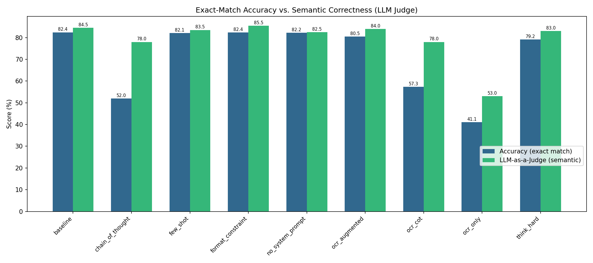
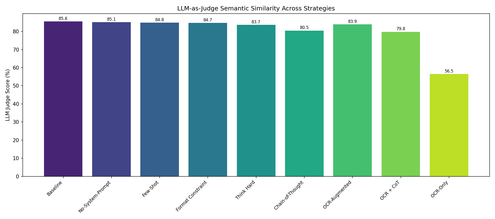
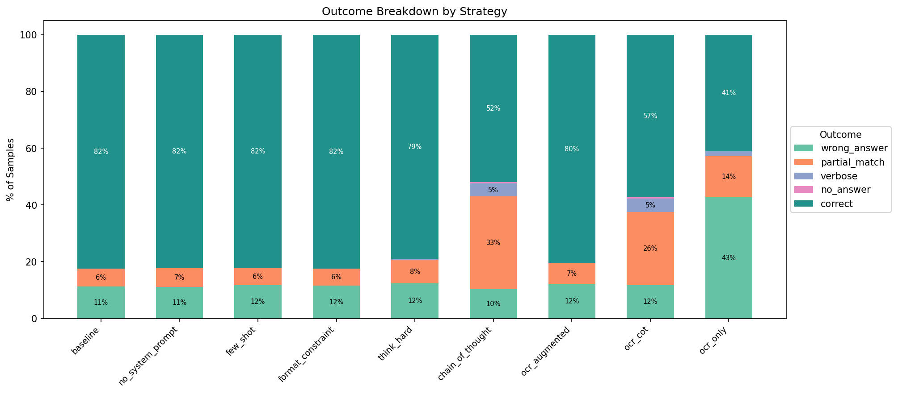
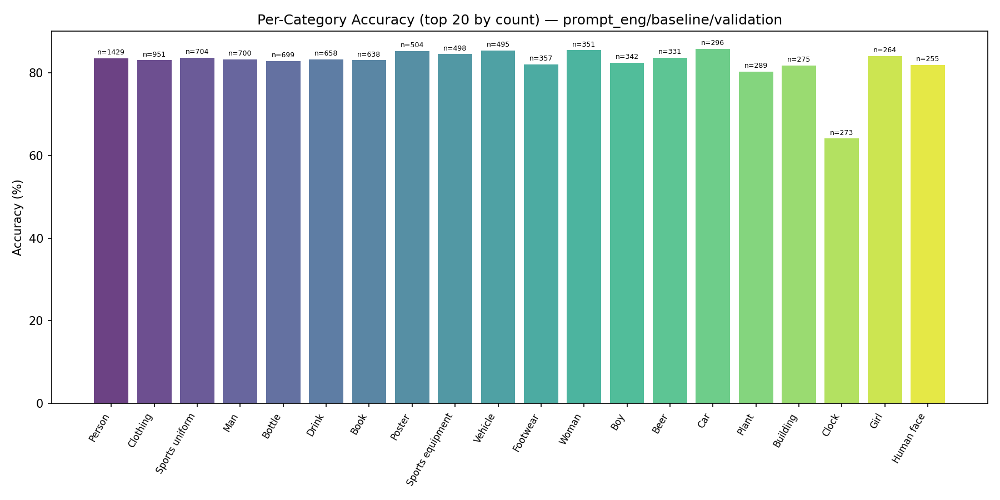

# Visual Understanding with TextVQA: Prompt Engineering with Qwen2.5-VL-3B

**Harlan Stevens**

May 7, 2026

---

## Abstract

We evaluate the Qwen2.5-VL-3B-Instruct vision-language model on the TextVQA dataset using six prompt engineering strategies that each ablate a single variable from a shared baseline: OCR-augmented prompting, chain-of-thought (CoT) reasoning, removal of the system prompt, a combined OCR+CoT approach, and an OCR-only ablation (no image). All strategies are evaluated on accuracy, VQA accuracy, BLEU, METEOR, ROUGE-L, F1, precision/recall, and LLM-as-a-judge semantic scoring across the full 5,000-sample validation set. The baseline strategy achieves 82.4% accuracy, with the no-system-prompt and OCR-augmented variants performing comparably (82.2% and 80.5%). Chain-of-thought reasoning dramatically reduces exact-match accuracy to 41.7% despite the LLM judge indicating 78.0% semantic correctness, revealing that *answer format* matters more than *reasoning depth* for exact-match VQA metrics. Per-category analysis identifies Clock/Watch images as a consistent failure mode (64.1% and 65.6% accuracy), driven by the difficulty of reading analog clock hands. LoRA fine-tuning infrastructure is additionally built, and per-category performance breakdowns are reported.

---

## Introduction

Semantic understanding of text embedded in natural images is a core challenge for vision-language models. Unlike standard VQA, where questions can often be answered from visual features alone, TextVQA (Singh et al., 2019) requires models to read text visible in real-world scenes---signs, labels, phone displays, product packaging---and reason about it to produce a correct answer.

Here, we evaluate Qwen2.5-VL-3B-Instruct (Bai et al., 2023) on the TextVQA dataset using prompt engineering. Rather than modifying model parameters, we design six prompt strategies that share a common structure and each ablate exactly one variable: (1) whether the model receives pre-extracted OCR tokens, (2) whether the model is asked to reason step-by-step or produce a concise direct answer, (3) whether a system prompt is included, and (4) whether the image is provided.

The TextVQA evaluation protocol uses exact string matching with answer normalization, which creates a fundamental tension between reasoning depth and answer format. Chain-of-thought prompting encourages richer intermediate reasoning but produces verbose outputs that fail exact matching, even when the model identifies the correct text. This tension is the central theme of our results.

Beyond the prompt engineering comparison, we build LoRA fine-tuning infrastructure to enable parameter-efficient adaptation on the TextVQA training set. All strategies are evaluated with accuracy (primary), VQA accuracy (official), BLEU, METEOR, ROUGE-L, F1, precision/recall, LLM-as-a-judge, and per-category accuracy breakdowns.

All code is available at: https://github.com/Harlan144/TextVQA_w_Qwen2.5

---

## Methods

### Dataset

The TextVQA dataset (Singh et al., 2019) contains 45,336 question-answer pairs across 28,408 images sourced from OpenImages. Questions require reading and reasoning about text visible in natural scenes. The dataset is split into 34,602 training, 5,000 validation, and 5,734 test samples.

Each sample provides: the image, a natural language question, 10 human-annotated answers, and pre-extracted OCR tokens detected in the image. The 10 answers per question enable soft evaluation: predictions matching at least 3 of 10 annotated answers receive full credit. The OCR tokens, extracted by Rosetta (Borisyuk et al., 2018), provide noisy but useful text signals that some of our prompt strategies leverage directly.

The test split does not include ground truth answers---evaluation on the test set requires submission to the official TextVQA evaluation server. Accordingly, all metrics in this work are reported on the validation set (5,000 samples). The training split is used only for LoRA fine-tuning.

<!-- TODO: Add figure showing example TextVQA sample with OCR tokens -->

### Model

We use Qwen2.5-VL-3B-Instruct, a 3-billion parameter vision-language model from the Qwen2.5-VL family (Bai et al., 2023). The model combines a ViT-based vision encoder with a causal language model decoder, supporting variable-resolution image inputs and instruction-following via chat-format prompting.

The model is loaded in 4-bit quantization (NF4 via bitsandbytes with double quantization) to fit within available GPU memory, reducing VRAM usage from approximately 7 GB (bfloat16) to approximately 2--3 GB. Inference uses greedy decoding with a maximum of 128 new tokens. All experiments use a fixed random seed of 42.

### Prompt Strategies

All strategies share a common structure: a system prompt enforcing concise answers, the image, the question, and an instruction line. Each strategy ablates exactly one variable relative to the baseline. The table below summarizes the design:

| Strategy | System Prompt | OCR Tokens | CoT | Image | Description |
|---|---|---|---|---|---|
| Baseline | Yes | No | No | Yes | System prompt + image + question + concise instruction |
| OCR-Augmented | Yes | **+** | No | Yes | Adds detected OCR tokens to the prompt |
| Chain-of-Thought | Yes | No | **+** | Yes | Replaces concise instruction with step-by-step reasoning |
| No-System-Prompt | **Removed** | No | No | Yes | Baseline without the system prompt |
| OCR + CoT | Yes | **+** | **+** | Yes | Adds both OCR tokens and CoT instruction |
| OCR-Only | Yes | **+** | No | **Removed** | OCR tokens without the image (ablation) |

The full prompt templates are shown below. All strategies use the Qwen chat format with system, user, and assistant roles.

**Shared system prompt** (used by all except No-System-Prompt):

> You are a visual question answering assistant specialized in reading text from images. Always give short, precise answers — just the exact text or value requested, nothing else. Never explain your reasoning.

**Concise instruction** (Baseline, OCR-Augmented, No-System-Prompt, OCR-Only):

> Answer the question about this image concisely.
> Answer:

**Chain-of-thought instruction** (Chain-of-Thought, OCR + CoT):

> Think step by step about what text in the image is relevant, then give your final answer on the last line after 'Answer:'.

**OCR prefix** (OCR-Augmented, OCR + CoT, OCR-Only):

> The following text was detected in the image: [{comma-separated OCR tokens}]

The key design tension is between reasoning depth and answer conciseness. CoT strategies encourage the model to identify text and reason about it, but produce multi-sentence outputs. Since TextVQA uses exact string matching, verbose answers score poorly even when the correct text is present in the response. For CoT strategies, we parse the model output for the last line beginning with "Answer:" and extract everything after it; if no such line exists, the full output is used.

### Evaluation Metrics

**Accuracy** (primary) scores 1.0 if the normalized prediction matches any of the 10 annotated answers, 0.0 otherwise. The final score is the mean across all questions.

**VQA Accuracy** (official) is the standard TextVQA metric. Predictions and ground truths are normalized (lowercase, remove articles and punctuation, convert number words to digits), then scored as Acc = min(1, n_match / 3) where n_match is the count of 10 annotated answers matching the prediction. The final score is the mean across all questions.

Both accuracy metrics use the same normalization: lowercase, remove articles ("a", "an", "the") and punctuation, convert number words to digits, expand contractions, and collapse whitespace.

Secondary metrics include: **BLEU** (corpus-level n-gram overlap with smoothing), **METEOR** (alignment-based with synonym matching), **ROUGE-L** (longest common subsequence F-measure), **F1** (token-level precision/recall harmonic mean, best match against any reference), **Precision/Recall** (token-level, reported separately), and **LLM-as-a-Judge** (the model itself scores whether the prediction semantically matches any of the 10 reference answers, evaluated on a 200-sample subset). For per-category analysis, accuracy is broken down by the image object classes provided in the dataset.

### LoRA Fine-Tuning Infrastructure

We additionally implement LoRA (Hu et al., 2022) fine-tuning infrastructure for parameter-efficient adaptation. The configuration targets the query and value projection layers (r=8, alpha=16, dropout 0.05) with AdamW (lr=2e-5). Training formats each sample as a chat conversation with the image, question, and target answer, with input tokens masked from the loss. This infrastructure is built and tested but full training runs are reported separately.

### Experimental Setup

| Setting | Value |
|---|---|
| Model | Qwen/Qwen2.5-VL-3B-Instruct |
| Quantization | 4-bit NF4 (bitsandbytes) |
| Max new tokens | 128 |
| Batch size | 1 (variable image resolution) |
| Hardware | NVIDIA H100 NVL (96 GB) |
| Random seed | 42 |

The evaluation protocol has two stages:

1. **Zero-shot baseline**: Evaluate the pretrained model with the baseline prompt on the full validation set (5,000 samples).
2. **Prompt strategy comparison**: Run all six strategies on the validation set to compare their effectiveness.

---

## Results

### Strategy Comparison

Table 1 presents the full results for all six prompt strategies evaluated on the 5,000-sample TextVQA validation set.

**Table 1.** Performance of each prompt strategy on the TextVQA validation set (5,000 samples). Accuracy and VQA Accuracy are the primary metrics; secondary metrics capture different aspects of answer quality. LLM Judge is evaluated on a 200-sample subset.

| Strategy | Accuracy | VQA Acc | BLEU | METEOR | ROUGE-L | F1 | Precision | Recall | LLM Judge |
|---|---|---|---|---|---|---|---|---|---|
| **Baseline** | **82.4** | **78.0** | **24.6** | **53.3** | **87.2** | **86.8** | 86.9 | **87.6** | **84.5** |
| No-System-Prompt | 82.2 | 77.8 | 22.2 | 50.3 | 87.0 | 86.6 | 86.7 | 87.5 | 82.5 |
| OCR-Augmented | 80.5 | 76.3 | 22.6 | 52.2 | 85.5 | 85.0 | 85.3 | 85.8 | 84.0 |
| OCR + CoT | 47.3 | 44.6 | 1.3 | 37.5 | 56.3 | 57.1 | 54.8 | 84.4 | 78.0 |
| Chain-of-Thought | 41.7 | 38.9 | 1.6 | 35.8 | 52.8 | 54.0 | 50.6 | 85.4 | 78.0 |
| OCR-Only | 41.1 | 38.4 | 5.7 | 26.0 | 49.8 | 49.2 | 49.7 | 51.3 | 53.0 |

The strategies cluster into two clear groups. The top group (Baseline, No-System-Prompt, OCR-Augmented) all produce concise direct answers and achieve 80--82% accuracy. The bottom group (CoT variants, OCR-Only) score 41--47% on exact match. Notably, the CoT strategies maintain high recall (84--85%) because the correct answer text is typically present somewhere in the verbose output, but precision drops to ~51--55% because of the surrounding reasoning text.

**Figure 1.** Grouped bar chart comparing accuracy (match-any) and VQA accuracy (official min(1, n/3)) across all six strategies.

### LLM-as-a-Judge

The LLM-as-a-judge metric reveals that exact-match accuracy understates the semantic correctness of CoT strategies. The judge—the model itself—scores whether the prediction semantically matches the reference answers, independent of format.

**Figure 2.** LLM-as-a-judge semantic similarity scores across strategies. CoT strategies score 78.0%, much closer to the baseline's 84.5% than exact-match accuracy suggests (41.7% vs. 82.4%).

The gap between exact-match accuracy and LLM judge score is largest for CoT strategies: Chain-of-Thought scores 41.7% on accuracy but 78.0% with the judge (a 36.3 percentage point gap). For baseline, the gap is only 2.1 points (82.4% vs 84.5%). This confirms that CoT outputs contain the correct information but fail the exact-match evaluation protocol. OCR-Only is the exception: the LLM judge also scores it low (53.0%), confirming that without the image, the model genuinely struggles rather than just formatting poorly.

### Qualitative Examples

**Table 2.** Examples where baseline succeeds but chain-of-thought fails, illustrating the format vs. reasoning tradeoff. The CoT output typically contains the correct answer embedded in reasoning text.

| Question | Ground Truth | Baseline Prediction | CoT Prediction | CoT Raw Output (truncated) |
|---|---|---|---|---|
| "What is the brand of this camera?" | dakota | **Dakota** (correct) | "To determine the brand..." (wrong) | "...The text 'DAKOTA DIGITAL' is clearly visible on the camera..." |
| "What kind of beer is this?" | ale, stone | **stone** (correct) | Pale Ale (wrong) | "...The label mentions 'STONE' prominently..." |
| "What brand of watch is that?" | ap | **AP** (correct) | Audemars Piguet (wrong) | "...distinctive features that might indicate the brand name..." |
| "What color are the letters on this sign?" | red | **red** (correct) | "The text 'Denny's' is displayed..." (wrong) | Full sentence instead of one word |

<!-- TODO: Include actual images from dataset for these examples (image IDs: 003a8ae2ef43b901, 2b538a43dd933fc1, 181f00d3ee2b2076, 5ce862cbefd8458f) -->

**Table 3.** Examples where chain-of-thought succeeds but baseline fails, showing cases where reasoning helps.

| Question | Ground Truth | Baseline Prediction | CoT Prediction |
|---|---|---|---|
| "How much for a can of skoal?" | 3.82 | $4.52 (wrong) | **$3.82** (correct) |
| "What beer is this?" | schin | schnu cervejao (wrong) | **Schin** (correct) |
| "Who is the author of this book?" | w.st.reymont | W. ST. REYMONDT (wrong) | **W.ST.REYMONT** (correct) |

<!-- TODO: Include actual images for these examples (image IDs: fa9ffd5aca1e4e51, 1f54ecbe84b9805f, 1ef8743670718aa2) -->

CoT reasoning helps baseline fail cases only rarely: 2,120 samples flip from correct (baseline) to incorrect (CoT), while only 81 flip from incorrect to correct. When CoT does help, it is typically on questions requiring multi-step reading (e.g., locating specific text among many candidates, or reading partially obscured characters where step-by-step reasoning yields a more careful reading).

### Error Analysis

Figure 3 shows the outcome breakdown across all strategies as a stacked percentage chart.

**Figure 3.** Stacked bar chart showing the percentage of correct, wrong answer, partial match, verbose, and no-answer outcomes for each strategy.

The error profiles differ qualitatively between strategy groups:

- **Concise strategies** (Baseline, No-System-Prompt, OCR-Augmented): ~80--82% correct, with errors dominated by wrong answers (11--12%) and partial matches (6--7%). Verbose errors are essentially absent (<0.1%).
- **CoT strategies** (Chain-of-Thought, OCR + CoT): ~42--47% correct, with the dominant error type being partial match (37--44%). These are answers where the correct text appears inside a longer response. Verbose errors also spike to 6%, and genuine wrong answers are actually *lower* than for concise strategies (8--9%).
- **OCR-Only**: 41% correct with 43% wrong answers—the highest wrong-answer rate. Without the image, the model frequently picks the wrong OCR token.

The key insight is that CoT strategies do not produce more wrong answers—they produce more *formatting* errors. The model identifies the correct text but wraps it in reasoning that fails exact matching.

### Per-Category Performance

Figure 4 shows accuracy broken down by the 20 most frequent image categories for the baseline strategy.

**Figure 4.** Per-category accuracy for the baseline strategy (top 20 categories by sample count). Most categories cluster around the 80--86% mean, with Clock as a notable outlier at 64.1%.

Most categories perform within a narrow band of 80--86%, but two categories stand out as difficult:

| Category | Accuracy | Count | Notes |
|---|---|---|---|
| Clock | 64.1% | 273 | Analog clock reading |
| Watch | 65.6% | 215 | Analog watch reading |
| Wall Clock | 57.1% | 91 | Subset of Clock |
| Alarm Clock | 50.0% | 28 | Small analog faces |

At the other end, Traffic Sign (93.2%), Stop Sign (98.4%), and Billboard (92.2%) are the easiest categories—large, clearly printed text with high contrast.

### Worst Category: Clock

Clock images are the worst-performing high-count category (64.1% accuracy, n=273). The failure mode is consistent: the model cannot reliably read analog clock hands. Table 4 shows representative failures.

**Table 4.** Clock failure examples across strategies. The model consistently struggles with analog time reading across all strategies.

| Question | Ground Truth | Baseline | CoT | OCR-Augmented |
|---|---|---|---|---|
| "What is the time?" | 5:41 | 10:07 | 10:07 | 10:07 |
| "What time does the clock say?" | 4:34 | 10:23 | 10:10 | — |
| "What time does the watch say?" | 4:49 | 10:35 | 10:15 | — |
| "What time does the top clock show?" | 10:07 | 10:10 | 10:02 | 10:10 |

<!-- TODO: Include actual Clock failure images (image IDs: 181f00d3ee2b2076, 43d24d5cd7aa9792, e6aafe9677bd0f76, 14e0ea396adc7cca) -->

The model's clock predictions are consistently wrong across all strategies, indicating this is a fundamental vision capability gap rather than a prompt engineering issue. No prompt strategy—including CoT reasoning about hand positions—reliably fixes the problem. OCR tokens are also unhelpful because analog clocks typically contain no machine-readable text (only the numeral positions, not the current time).

---

## Discussion

### Format vs. Reasoning

The most striking result is that chain-of-thought reasoning, despite being a widely used technique for improving LLM performance, actively hurts TextVQA accuracy. This is not because CoT produces worse reasoning—inspection of CoT outputs shows the model frequently identifies the correct text—but because the evaluation protocol requires exact string matching against short annotated answers. A response like "The text on the phone says NOKIA, so the brand is Nokia" contains the correct answer but fails to match "nokia" exactly.

The LLM-as-a-judge metric confirms this interpretation: CoT strategies score 78.0% on semantic correctness versus 84.5% for baseline, a much smaller gap than the 41.7% vs 82.4% difference on exact match. The error analysis further supports this: CoT strategies have *fewer* wrong-answer errors than the baseline (8--9% vs 11%) but *far more* partial-match and verbose errors (44% vs 6%).

This highlights a broader limitation of exact-match VQA evaluation. The choice of evaluation metric fundamentally shapes which prompt strategies appear "best." For downstream applications where semantic correctness matters more than exact format (e.g., clinical report generation), CoT strategies may in fact be preferable.

### OCR Tokens as Auxiliary Input

Contrary to our initial expectation, OCR-augmented prompting slightly *decreased* accuracy relative to baseline (80.5% vs 82.4%). This suggests that Qwen2.5-VL-3B's own text recognition from images is already strong, and adding noisy OCR tokens from Rosetta—which can contain misspellings, partial detections, and irrelevant text—introduces more confusion than signal for this model.

The OCR-only ablation clarifies the value of the image: removing it entirely drops accuracy to 41.1%, confirming that visual understanding contributes roughly half of the model's performance beyond what text tokens alone provide.

### System Prompt Robustness

The no-system-prompt ablation shows nearly identical performance to baseline (82.2% vs 82.4%), suggesting that the model's instruction-following behavior is robust even without an explicit system prompt directing concise answers. This is practically useful: it means the system prompt can be reserved for domain-specific instructions without worrying about degrading answer format.

### Comparison to Published Baselines

<!-- TODO: Add comparison to published TextVQA baselines for Qwen2.5-VL and other models of similar size -->

### Limitations

Several limitations should be noted. First, only one model (Qwen2.5-VL-3B) is evaluated; a multi-model comparison would strengthen the generality of findings about prompt strategy effectiveness. Second, the 4-bit quantization may reduce model capability relative to full-precision inference, though this is necessary given GPU memory constraints. Third, the prompt strategies are manually designed; automated prompt optimisation (e.g., DSPy or OPRO) could potentially find better formulations. Fourth, CoT strategies use a simple "Answer:" parsing heuristic that may miss correct answers formatted differently. Finally, while LoRA fine-tuning infrastructure is built, full training runs and comparison against prompt engineering would provide a more complete picture.

---

## Conclusion

We evaluated Qwen2.5-VL-3B-Instruct on TextVQA using six prompt engineering strategies, each ablating a single variable from a shared baseline. The baseline strategy achieves 82.4% accuracy on the 5,000-sample validation set, with removing the system prompt (82.2%) and adding OCR tokens (80.5%) having minimal impact. Chain-of-thought reasoning dramatically reduces exact-match accuracy to 41.7% despite achieving 78.0% semantic correctness by LLM-as-a-judge, confirming that verbose output formatting—not reasoning quality—is the primary failure mode.

Per-category analysis reveals that Clock and Watch images are a systematic weak point (64.1% and 65.6% accuracy), driven by the model's inability to read analog clock hands—a vision capability gap unaffected by any prompt strategy.

The practical takeaway is clear: for exact-match VQA evaluation, answer format matters more than reasoning depth. Constraining output to short, direct answers is more effective than encouraging step-by-step reasoning. This finding is specific to exact-match metrics; the LLM-as-a-judge scores suggest that CoT strategies may perform better when semantic correctness is the criterion.

Future work could explore: (1) hybrid strategies that use CoT reasoning internally but produce concise final answers through a two-stage generation process, (2) LoRA fine-tuning to adapt the model's text reading and answer formatting jointly, (3) automated prompt optimisation to search the strategy space more systematically, and (4) evaluation with additional semantic similarity metrics alongside exact matching to provide a more complete picture of model capability.

---

## References

- Antol, S., et al. (2015). VQA: Visual question answering. *ICCV 2015*.
- Bai, J., et al. (2023). Qwen-VL: A versatile vision-language model for understanding, localization, text reading, and beyond. *arXiv preprint arXiv:2308.12966*.
- Borisyuk, F., Gordo, A., & Sivakumar, V. (2018). Rosetta: Large scale system for text detection and recognition in images. *KDD 2018*.
- Hu, E. J., et al. (2022). LoRA: Low-rank adaptation of large language models. *ICLR 2022*.
- Li, J., Li, D., Savarese, S., & Hoi, S. (2023). BLIP-2: Bootstrapping language-image pre-training with frozen image encoders and large language models. *ICML 2023*.
- Liu, H., Li, C., Wu, Q., & Lee, Y. J. (2023). Visual instruction tuning. *NeurIPS 2023*.
- Singh, A., Natarajan, V., Shah, M., Jiang, Y., Chen, X., Batra, D., Parikh, D., & Rohrbach, M. (2019). Towards VQA models that can read. *CVPR 2019*.
